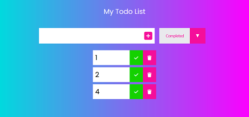
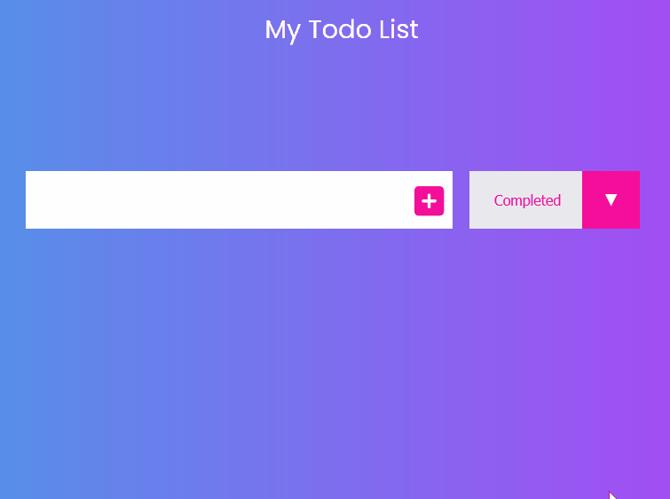

<p align="center">
  <a href="" rel="noopener">
 </a>
</p>

<h3 align="center">Lista ToDo</h3>

<div align="center">

[]()
[](https://github.com/rogeriopio/todoList/issues)
[](https://github.com/rogeriopio/todoList/pulls)
[](/LICENSE)

</div>

---

<p align="center"> Registre as atividades que serão realizadas no dia a dia 
    <br> 
</p>

## 📝 Table of Contents

-   [Sobre](#sobre)
-   [Demonstração](#demonstração)
-   [Inciando o Projeto](#iniciando-o-projeto)
-   [ Como este projeto funciona](#como-este-projeto-funciona)
-   [Tecnologia Utilizada](#tecnologia-utilizada)
-   [Autor](#autor)

## 🧐 Sobre

Programa simples que tem o intuito de salvar suas as tarefas diárias e colocar um marcador caso a tarefa seja finalizada

## 🎥 Demonstração

</a>

## 🏁 Iniciando o projeto

Como instalar o projeto

### Pré-requisitos

Antes de começar você vai precisar ter instalado em sua maquina as seguintes ferramentas:

-   [VSCode](https://code.visualstudio.com/)
-   [Git](https://git-scm.com)
-   [Node.js](https://nodejs.org/en/)
-   [Extensão LiveServer VsCode](https://marketplace.visualstudio.com/items?itemName=ritwickdey.LiveServer)

```
# Clone este repositório
$ git clone https://github.com/rogeriopio/todoList.git

# Acesse a pasta do projeto no terminal/cmd
$ cd todolist

# Instale as dependências
$ npm install
```

## 💭 Como este projeto funciona

Adicione ou remova suas tarefas
Selecione apenas as tarefas que estão completas ou incompletas 
Para verificar como o projeto funciona ,teste pelo link [TodoList](https://rogeriopio.github.io/todoList/)

# Tecnologia Utilizada

As seguintes ferramentas foram usadas na construção do projeto:

-   [](https://developer.mozilla.org/pt-BR/docs/Web/JavaScript)
-   [](https://developer.mozilla.org/pt-BR/docs/Web/CSS)
-   [](https://developer.mozilla.org/pt-BR/docs/Web/HTML)

## ✍️ Autor

Feito por [@rogeriopio](https://github.com/rogeriopio/) 👋🏽 Entre em contato!

[](https://twitter.com/rogerioxpio) [](https://www.linkedin.com/in/rogerioxpio/)
[](mailto:rogerioxpio@gmail.com)
